# StyledConsole Developer Guide

**Version:** 0.9.0
**Last Updated:** December 3, 2025
**Audience:** Contributors and advanced users

______________________________________________________________________

## Table of Contents

1. [Architecture Overview](#architecture-overview)
1. [Module Structure](#module-structure)
1. [Core Components](#core-components)
1. [Policy-Aware Rendering](#policy-aware-rendering)
1. [Extending the Library](#extending-the-library)
1. [API Reference](#api-reference)
1. [Testing](#testing)
1. [Code Style](#code-style)

______________________________________________________________________

## Architecture Overview

### System Layers

```mermaid
%%{init: {'theme': 'base', 'themeVariables': { 'primaryColor': '#4CAF50', 'primaryTextColor': '#fff', 'primaryBorderColor': '#388E3C', 'lineColor': '#78909C', 'secondaryColor': '#E3F2FD', 'tertiaryColor': '#FFF3E0'}}}%%
flowchart TB
    subgraph User["🖥️ User Application"]
        APP[/"📱 Application Code"/]
    end

    subgraph Facade["🎯 Public API Layer"]
        CONSOLE[["🎨 Console<br/>console.py"]]
    end

    subgraph Managers["⚙️ Manager Layer"]
        RE[["🖼️ RenderingEngine"]]
        EM[["📤 ExportManager"]]
        TM[["🔍 TerminalManager"]]
    end

    subgraph Core["🔧 Core Layer"]
        BM[📦 box_mapping]
        ST[🎭 styles]
        BN[🔤 banner]
    end

    subgraph Effects["✨ Effects Layer"]
        ENG[⚡ engine.py]
        STR[🎯 strategies.py]
    end

    subgraph Utils["🛠️ Utilities Layer"]
        TXT[📝 text.py]
        CLR[🎨 color.py]
        WRP[📐 wrap.py]
        TRM[💻 terminal.py]
    end

    subgraph Backend["💎 Rich Backend"]
        RICH[["🏛️ Rich Console<br/>Panel, Text, Group"]]
    end

    APP --> CONSOLE
    CONSOLE --> RE
    CONSOLE --> EM
    CONSOLE --> TM
    RE --> BM
    RE --> ST
    RE --> BN
    RE --> ENG
    ENG --> STR
    RE --> TXT
    RE --> CLR
    RE --> WRP
    TM --> TRM
    RE --> RICH
    EM --> RICH

    style User fill:#E8F5E9,stroke:#4CAF50,stroke-width:2px
    style Facade fill:#E3F2FD,stroke:#2196F3,stroke-width:3px
    style Managers fill:#FFF3E0,stroke:#FF9800,stroke-width:2px
    style Core fill:#FCE4EC,stroke:#E91E63,stroke-width:2px
    style Effects fill:#F3E5F5,stroke:#9C27B0,stroke-width:2px
    style Utils fill:#E0F7FA,stroke:#00BCD4,stroke-width:2px
    style Backend fill:#EDE7F6,stroke:#673AB7,stroke-width:2px

    style CONSOLE fill:#4CAF50,color:#fff,stroke:#2E7D32,stroke-width:3px
    style RE fill:#FF9800,color:#fff,stroke:#F57C00,stroke-width:2px
    style EM fill:#FF9800,color:#fff,stroke:#F57C00,stroke-width:2px
    style TM fill:#FF9800,color:#fff,stroke:#F57C00,stroke-width:2px
    style RICH fill:#673AB7,color:#fff,stroke:#512DA8,stroke-width:3px
    style ENG fill:#9C27B0,color:#fff,stroke:#7B1FA2,stroke-width:2px
    style APP fill:#81C784,color:#1B5E20,stroke:#4CAF50,stroke-width:2px
```

### Data Flow: Frame Rendering

```mermaid
%%{init: {'theme': 'base', 'themeVariables': { 'actorBkg': '#4CAF50', 'actorTextColor': '#fff', 'actorLineColor': '#388E3C', 'signalColor': '#2196F3', 'signalTextColor': '#1565C0', 'noteBkgColor': '#FFF9C4', 'noteTextColor': '#F57F17'}}}%%
sequenceDiagram
    autonumber
    participant App as 📱 Application
    participant Con as 🎨 Console
    participant RE as 🖼️ RenderingEngine
    participant BM as 📦 box_mapping
    participant Rich as 💎 Rich Console

    App->>+Con: frame(content, title, border)
    Con->>+RE: print_frame(...)
    RE->>+BM: get_box_style(border)
    BM-->>-RE: Rich Box object
    Note over RE: Build Panel with<br/>colors & gradients
    RE->>+Rich: Panel(content, box=box)
    Rich->>Rich: render to ANSI
    Rich-->>-App: ✨ Terminal output
    deactivate RE
    deactivate Con
```

### Data Flow: Gradient Application

```mermaid
%%{init: {'theme': 'base', 'themeVariables': { 'actorBkg': '#9C27B0', 'actorTextColor': '#fff', 'signalColor': '#E91E63', 'loopTextColor': '#AD1457'}}}%%
sequenceDiagram
    autonumber
    participant RE as 🖼️ RenderingEngine
    participant GE as ⚡ Gradient Engine
    participant PS as 🎯 PositionStrategy
    participant CS as 🎨 ColorSource

    RE->>+GE: apply_gradient(lines, strategy, colors)
    loop 🔄 For each character
        GE->>+PS: calculate(row, col)
        PS-->>-GE: position (0.0-1.0)
        GE->>+CS: get_color(position)
        CS-->>-GE: hex color
        GE->>GE: 🎨 wrap char with ANSI
    end
    GE-->>-RE: ✅ colorized lines
```

### Design Patterns

```mermaid
%%{init: {'theme': 'base', 'themeVariables': { 'primaryColor': '#E3F2FD', 'lineColor': '#78909C'}}}%%
classDiagram
    direction TB

    class Console {
        <<🎯 Facade>>
        +frame()
        +banner()
        +text()
        +export_html()
    }

    class RenderingEngine {
        <<⚙️ Coordinator>>
        +print_frame()
        +print_banner()
    }

    class PositionStrategy {
        <<🎯 Strategy>>
        +calculate() float
    }

    class VerticalPosition {
        <<📊 Concrete>>
        +calculate()
    }

    class HorizontalPosition {
        <<📊 Concrete>>
        +calculate()
    }

    class DiagonalPosition {
        <<📊 Concrete>>
        +calculate()
    }

    class ColorSource {
        <<🎨 Strategy>>
        +get_color() str
    }

    class LinearGradient {
        <<🌈 Concrete>>
        +get_color()
    }

    class RainbowSpectrum {
        <<🌈 Concrete>>
        +get_color()
    }

    Console --> RenderingEngine
    PositionStrategy <|-- VerticalPosition
    PositionStrategy <|-- HorizontalPosition
    PositionStrategy <|-- DiagonalPosition
    ColorSource <|-- LinearGradient
    ColorSource <|-- RainbowSpectrum

    style Console fill:#4CAF50,color:#fff,stroke:#2E7D32,stroke-width:3px
    style RenderingEngine fill:#FF9800,color:#fff,stroke:#F57C00,stroke-width:2px
    style PositionStrategy fill:#2196F3,color:#fff,stroke:#1565C0,stroke-width:2px
    style ColorSource fill:#E91E63,color:#fff,stroke:#C2185B,stroke-width:2px
    style VerticalPosition fill:#64B5F6,color:#1565C0,stroke:#2196F3
    style HorizontalPosition fill:#64B5F6,color:#1565C0,stroke:#2196F3
    style DiagonalPosition fill:#64B5F6,color:#1565C0,stroke:#2196F3
    style LinearGradient fill:#F48FB1,color:#880E4F,stroke:#E91E63
    style RainbowSpectrum fill:#F48FB1,color:#880E4F,stroke:#E91E63
```

| Pattern      | Usage                                     |
| ------------ | ----------------------------------------- |
| **Facade**   | `Console` class wraps managers            |
| **Strategy** | Gradient engine (position, color, target) |
| **Adapter**  | `box_mapping.py` adapts borders to Rich   |

______________________________________________________________________

## Module Structure

### Package Dependency Graph

```mermaid
%%{init: {'theme': 'base', 'themeVariables': { 'primaryColor': '#E8F5E9', 'lineColor': '#78909C'}}}%%
flowchart LR
    subgraph styledconsole["📦 styledconsole"]
        INIT[🚀 __init__.py]
        CON[🎨 console.py]
        EMO[😀 emojis.py]
        TYP[📋 types.py]
        ANI[🎬 animation.py]
    end

    subgraph core["🔧 core"]
        RE[🖼️ rendering_engine]
        EM[📤 export_manager]
        TM[🔍 terminal_manager]
        BM[📦 box_mapping]
        ST[🎭 styles]
        BN[🔤 banner]
    end

    subgraph effects["✨ effects"]
        ENG[⚡ engine]
        STR[🎯 strategies]
    end

    subgraph utils["🛠️ utils"]
        TXT[📝 text]
        CLR[🎨 color]
        WRP[📐 wrap]
        TRM[💻 terminal]
        VAL[✅ validation]
        ES[😀 emoji_support]
        CD[🎨 color_data]
    end

    subgraph presets["🎁 presets"]
        STA[📊 status]
        SUM[📋 summary]
        DSH[📈 dashboard]
    end

    CON --> RE
    CON --> EM
    CON --> TM
    RE --> BM
    RE --> ST
    RE --> BN
    RE --> ENG
    ENG --> STR
    TXT --> ES
    CLR --> CD
    STA --> CON
    SUM --> CON
    DSH --> CON

    style styledconsole fill:#E8F5E9,stroke:#4CAF50,stroke-width:2px
    style core fill:#E3F2FD,stroke:#2196F3,stroke-width:2px
    style effects fill:#FFF3E0,stroke:#FF9800,stroke-width:2px
    style utils fill:#E0F7FA,stroke:#00BCD4,stroke-width:2px
    style presets fill:#FCE4EC,stroke:#E91E63,stroke-width:2px

    style CON fill:#4CAF50,color:#fff,stroke:#2E7D32,stroke-width:3px
    style RE fill:#2196F3,color:#fff,stroke:#1565C0,stroke-width:2px
    style ENG fill:#FF9800,color:#fff,stroke:#F57C00,stroke-width:2px
    style EM fill:#2196F3,color:#fff,stroke:#1565C0
    style TM fill:#2196F3,color:#fff,stroke:#1565C0
    style BM fill:#64B5F6,color:#1565C0,stroke:#2196F3
    style ST fill:#64B5F6,color:#1565C0,stroke:#2196F3
    style BN fill:#64B5F6,color:#1565C0,stroke:#2196F3
    style STR fill:#FFB74D,color:#E65100,stroke:#FF9800
    style TXT fill:#4DD0E1,color:#006064,stroke:#00BCD4
    style CLR fill:#4DD0E1,color:#006064,stroke:#00BCD4
    style ES fill:#80DEEA,color:#006064,stroke:#00BCD4
    style CD fill:#80DEEA,color:#006064,stroke:#00BCD4
    style STA fill:#F48FB1,color:#880E4F,stroke:#E91E63
    style SUM fill:#F48FB1,color:#880E4F,stroke:#E91E63
    style DSH fill:#F48FB1,color:#880E4F,stroke:#E91E63
```

### Directory Structure

```text
src/styledconsole/
├── __init__.py                   # Public exports
├── console.py                    # Console facade (main API)
├── emojis.py                     # EMOJI constants (100+)
├── types.py                      # Type aliases
├── animation.py                  # Animation runner
│
├── core/                         # Core rendering
│   ├── box_mapping.py            # Border → Rich Box mapping
│   ├── rendering_engine.py       # Rich Panel coordinator
│   ├── banner.py                 # ASCII art (pyfiglet)
│   ├── styles.py                 # Border style definitions
│   ├── export_manager.py         # HTML export
│   └── terminal_manager.py       # Terminal detection
│
├── effects/                      # Gradient effects (v0.4.0)
│   ├── engine.py                 # Unified apply_gradient()
│   └── strategies.py             # Strategy classes
│
├── presets/                      # High-level presets
│   ├── status.py                 # status_frame()
│   ├── summary.py                # test_summary()
│   └── dashboard.py              # dashboard layouts
│
└── utils/                        # Utilities
    ├── text.py                   # Emoji-safe width calculation
    ├── emoji_support.py          # emoji package wrapper (4000+ emojis)
    ├── color.py                  # Color parsing & gradients
    ├── color_data.py             # CSS4 color definitions
    ├── terminal.py               # Terminal capabilities
    ├── validation.py             # Input validation
    └── wrap.py                   # Text wrapping
```

______________________________________________________________________

## Core Components

### Console (Facade)

The main entry point. Delegates to specialized managers.

```mermaid
%%{init: {'theme': 'base', 'themeVariables': { 'primaryColor': '#E8F5E9'}}}%%
classDiagram
    direction TB

    class Console {
        <<🎯 Facade>>
        -RichConsole _rich_console
        -TerminalManager _terminal_manager
        -RenderingEngine _rendering_engine
        -ExportManager _export_manager
        +frame(content, title, border, ...)
        +banner(text, font, colors, ...)
        +text(text, color, bold, ...)
        +rule(title, color)
        +newline()
        +clear()
        +export_html() str
        +export_text() str
    }

    class RenderingEngine {
        <<🖼️ Coordinator>>
        -RichConsole _console
        +print_frame(...)
        +print_banner(...)
        +print_text(...)
        +print_rule(...)
    }

    class ExportManager {
        <<📤 Exporter>>
        -RichConsole _console
        +export_html() str
        +export_text() str
    }

    class TerminalManager {
        <<🔍 Detector>>
        +profile TerminalProfile
        +detect_capabilities()
    }

    Console --> RenderingEngine : delegates
    Console --> ExportManager : delegates
    Console --> TerminalManager : queries

    style Console fill:#4CAF50,color:#fff,stroke:#2E7D32,stroke-width:3px
    style RenderingEngine fill:#2196F3,color:#fff,stroke:#1565C0,stroke-width:2px
    style ExportManager fill:#FF9800,color:#fff,stroke:#F57C00,stroke-width:2px
    style TerminalManager fill:#9C27B0,color:#fff,stroke:#7B1FA2,stroke-width:2px
```

```python
class Console:
    def __init__(self, record=False, width=None, detect_terminal=True, debug=False):
        self._rich_console = RichConsole(record=record, width=width)
        self._terminal_manager = TerminalManager() if detect_terminal else None
        self._rendering_engine = RenderingEngine(self._rich_console)
        self._export_manager = ExportManager(self._rich_console)
```

**Public Methods:**

- `frame()` - Render bordered frame
- `banner()` - Render ASCII art banner
- `text()` - Print styled text
- `rule()` - Print horizontal rule
- `newline()` - Print blank line
- `clear()` - Clear screen
- `export_html()` - Export to HTML
- `export_text()` - Export plain text

### RenderingEngine

Orchestrates Rich-native rendering.

```python
class RenderingEngine:
    def print_frame(self, content, title, border, colors, gradients, ...):
        box = get_box_style(border)
        panel = Panel(content, title=title, box=box, ...)
        self._console.print(panel)
```

### Gradient Engine (Strategy Pattern)

Located in `effects/engine.py` and `effects/strategies.py`.

```mermaid
%%{init: {'theme': 'base', 'themeVariables': { 'primaryColor': '#FFF3E0'}}}%%
flowchart LR
    subgraph Input["📥 Input"]
        LINES[/"📄 Text Lines"/]
        BORDER[/"🔲 Border Chars"/]
    end

    subgraph Strategies["🎯 Strategies"]
        PS[📍 Position Strategy]
        CS[🎨 Color Source]
        TF[🎭 Target Filter]
    end

    subgraph Engine["⚙️ Engine"]
        AG{{"⚡ apply_gradient"}}
    end

    subgraph Output["📤 Output"]
        COLORED[\"🌈 Colorized Lines<br/>with ANSI codes"\]
    end

    LINES --> AG
    BORDER --> AG
    PS --> AG
    CS --> AG
    TF --> AG
    AG --> COLORED

    style Input fill:#E3F2FD,stroke:#2196F3,stroke-width:2px
    style Strategies fill:#FCE4EC,stroke:#E91E63,stroke-width:2px
    style Engine fill:#FFF3E0,stroke:#FF9800,stroke-width:2px
    style Output fill:#E8F5E9,stroke:#4CAF50,stroke-width:2px

    style AG fill:#FF9800,color:#fff,stroke:#F57C00,stroke-width:3px
    style COLORED fill:#4CAF50,color:#fff,stroke:#2E7D32,stroke-width:2px
    style PS fill:#E91E63,color:#fff,stroke:#C2185B
    style CS fill:#E91E63,color:#fff,stroke:#C2185B
    style TF fill:#E91E63,color:#fff,stroke:#C2185B
```

```python
def apply_gradient(
    lines: list[str],
    position_strategy: PositionStrategy,
    color_source: ColorSource,
    target_filter: TargetFilter,
    border_chars: set[str],
) -> list[str]:
    ...
```

**Position Strategies:**

- `VerticalPosition` - Top (0.0) → Bottom (1.0)
- `HorizontalPosition` - Left (0.0) → Right (1.0)
- `DiagonalPosition` - Top-left → Bottom-right
- `OffsetPositionStrategy` - Adds offset for animation

**Color Sources:**

- `LinearGradient(start, end)` - Two-color interpolation
- `RainbowSpectrum()` - 7-color ROYGBIV

**Target Filters:**

- `ContentOnly` - Skip border characters
- `BorderOnly` - Skip content characters
- `Both` - Color everything

### Text Utilities

Located in `utils/text.py`. Critical for emoji support.

```mermaid
%%{init: {'theme': 'base', 'themeVariables': { 'primaryColor': '#E0F7FA'}}}%%
flowchart TB
    subgraph text.py["📝 text.py"]
        VW[["🔢 visual_width"]]
        SG[["✂️ split_graphemes"]]
        PTW[["📏 pad_to_width"]]
        TTW[["✂️ truncate_to_width"]]
    end

    subgraph Helpers["🔧 Internal Helpers"]
        GWL[_grapheme_width_legacy]
        GWS[_grapheme_width_standard]
        PAS[_parse_ansi_sequence]
        SEG[_should_extend_grapheme]
    end

    subgraph emoji_pkg["📦 emoji package"]
        EP[(🗄️ emoji.EMOJI_DATA<br/>4000+ entries)]
        IS[🔍 emoji.is_emoji]
    end

    VW --> SG
    VW --> GWL
    VW --> GWS
    SG --> PAS
    SG --> SEG
    GWL --> EP
    GWS --> EP

    style text.py fill:#E0F7FA,stroke:#00BCD4,stroke-width:2px
    style Helpers fill:#FFF3E0,stroke:#FF9800,stroke-width:2px
    style emoji_pkg fill:#E8F5E9,stroke:#4CAF50,stroke-width:2px

    style VW fill:#00BCD4,color:#fff,stroke:#00838F,stroke-width:2px
    style SG fill:#00BCD4,color:#fff,stroke:#00838F,stroke-width:2px
    style PTW fill:#26C6DA,color:#004D40,stroke:#00BCD4
    style TTW fill:#26C6DA,color:#004D40,stroke:#00BCD4
    style EP fill:#4CAF50,color:#fff,stroke:#2E7D32,stroke-width:2px
    style IS fill:#81C784,color:#1B5E20,stroke:#4CAF50
    style GWL fill:#FFB74D,color:#E65100,stroke:#FF9800
    style GWS fill:#FFB74D,color:#E65100,stroke:#FF9800
    style PAS fill:#FFB74D,color:#E65100,stroke:#FF9800
    style SEG fill:#FFB74D,color:#E65100,stroke:#FF9800
```

```python
# Visual width (emoji-aware)
visual_width("✅")  # Returns 2
visual_width("⚠️")  # Returns 1 (VS16 corrected)

# Spacing adjustment
adjust_emoji_spacing_in_text("⚠️ Warning")  # "⚠️  Warning"

# Validation
validate_emoji("👨‍💻")  # {"safe": False, "reason": "ZWJ sequence"}
```

### Color Utilities

Located in `utils/color.py`.

```mermaid
%%{init: {'theme': 'base', 'themeVariables': { 'primaryColor': '#F3E5F5'}}}%%
flowchart LR
    subgraph Input["📥 Input Formats"]
        NAME[/"🏷️ Color Name<br/>dodgerblue"/]
        HEX[/"#️⃣ Hex Code<br/>#1E90FF"/]
        RGB[/"🔢 RGB Tuple<br/>30, 144, 255"/]
    end

    subgraph color.py["🎨 color.py"]
        PC{{"🔄 parse_color"}}
        IC[🌈 interpolate_color]
        HTR[➡️ hex_to_rgb]
        RTH[⬅️ rgb_to_hex]
    end

    subgraph color_data.py["📚 color_data.py"]
        CSS4[(🗄️ CSS4_COLORS<br/>148 colors)]
    end

    subgraph Output["📤 Output"]
        TUPLE[\"✅ (R, G, B)"\]
    end

    NAME --> PC
    HEX --> PC
    RGB --> PC
    PC --> CSS4
    PC --> HTR
    PC --> TUPLE
    IC --> PC
    IC --> RTH

    style Input fill:#E3F2FD,stroke:#2196F3,stroke-width:2px
    style color.py fill:#F3E5F5,stroke:#9C27B0,stroke-width:2px
    style color_data.py fill:#FCE4EC,stroke:#E91E63,stroke-width:2px
    style Output fill:#E8F5E9,stroke:#4CAF50,stroke-width:2px

    style PC fill:#9C27B0,color:#fff,stroke:#7B1FA2,stroke-width:3px
    style CSS4 fill:#E91E63,color:#fff,stroke:#C2185B,stroke-width:2px
    style TUPLE fill:#4CAF50,color:#fff,stroke:#2E7D32,stroke-width:2px
    style IC fill:#BA68C8,color:#fff,stroke:#9C27B0
    style HTR fill:#CE93D8,color:#4A148C,stroke:#9C27B0
    style RTH fill:#CE93D8,color:#4A148C,stroke:#9C27B0
```

```python
# Parse any color format
parse_color("dodgerblue")      # (30, 144, 255)
parse_color("#1E90FF")         # (30, 144, 255)
parse_color((30, 144, 255))    # (30, 144, 255)

# Gradient interpolation
interpolate_color("red", "blue", 0.5)  # Midpoint hex
```

______________________________________________________________________

## Policy-Aware Rendering

### Overview

StyledConsole v0.9.0 implements **comprehensive policy-awareness** throughout the
rendering pipeline. The `RenderPolicy` class controls how output adapts to different
terminal environments.

### Policy Flow

```text
Console(policy=RenderPolicy.from_env())
    │
    ├─→ RenderingEngine(policy)
    │       │
    │       ├─→ box_mapping.get_box_style_for_policy()
    │       │       └─→ ASCII box when unicode=False
    │       │
    │       ├─→ effects.engine.apply_gradient(policy=policy)
    │       │       └─→ Plain text when color=False
    │       │
    │       └─→ utils/color.colorize_text(policy=policy)
    │               └─→ Skipped when color=False
    │
    ├─→ StyledProgress(policy)
    │       └─→ Text-based fallback when TTY unavailable
    │
    └─→ icons module
            └─→ Colored ASCII when emoji=False
```

### Implementation Pattern

All policy-aware functions follow this pattern:

```python
def colorize_text(
    text: str,
    color: str,
    policy: RenderPolicy | None = None
) -> str:
    """Apply color, respecting policy."""
    # Guard clause: skip if policy disables colors
    if policy is not None and not policy.color:
        return text

    # Normal colorization logic
    return f"\033[38;2;{r};{g};{b}m{text}\033[0m"
```

### Policy-Aware Components

| Module                     | Function/Class               | Policy Param |
| -------------------------- | ---------------------------- | ------------ |
| `utils/color.py`           | `apply_line_gradient()`      | ✅           |
| `utils/color.py`           | `colorize_text()`            | ✅           |
| `effects/engine.py`        | `apply_gradient()`           | ✅           |
| `core/box_mapping.py`      | `get_box_style_for_policy()` | ✅           |
| `core/progress.py`         | `StyledProgress`             | ✅           |
| `core/rendering_engine.py` | `RenderingEngine`            | ✅           |
| `animation.py`             | `_supports_cursor_control()` | Implicit     |
| `presets/status.py`        | Uses `icons` module          | Implicit     |
| `presets/summary.py`       | Uses `icons` module          | Implicit     |

### RenderPolicy Class

```python
@dataclass
class RenderPolicy:
    color: bool = True       # ANSI color codes
    unicode: bool = True     # Unicode box drawing
    emoji: bool = True       # Unicode emoji symbols
    force_ascii_icons: bool = False  # Force ASCII even for icons

    @classmethod
    def from_env(cls) -> RenderPolicy:
        """Auto-detect from environment."""
        # Detects: NO_COLOR, FORCE_COLOR, TERM=dumb, CI, TTY

    @classmethod
    def full(cls) -> RenderPolicy:
        """All features enabled."""

    @classmethod
    def minimal(cls) -> RenderPolicy:
        """ASCII only, no colors."""

    @classmethod
    def ci_friendly(cls) -> RenderPolicy:
        """Colors enabled, ASCII icons."""

    def with_override(self, **kwargs) -> RenderPolicy:
        """Clone with specific overrides."""
```

### Progress Bar Fallback

When Rich progress bars aren't suitable (piped output, no TTY, limited terminal):

```python
class StyledProgress:
    def _should_use_fallback(self) -> bool:
        """Check if we need text-based output."""
        if self._policy is not None:
            if not self._policy.color:
                return True
        if not sys.stdout.isatty():
            return True
        return False

    def _fallback_update(self, task: _FallbackTask) -> None:
        """Text-based progress: [####........] 40% (40/100) 00:05 / 00:08"""
        bar = "#" * filled + "." * empty
        print(f"\r[{bar}] {percent}% ({completed}/{total}) {elapsed} / {eta}", end="")
```

### Icons Module Integration

Presets use the `icons` module for policy-aware symbol rendering:

```python
# In presets/status.py
from styledconsole import icons

STATUS_THEME = {
    "PASS": {"icon": icons.CHECK, "color": "green"},
    "FAIL": {"icon": icons.CROSS, "color": "red"},
    "ERROR": {"icon": icons.FIRE, "color": "red"},
    "WARN": {"icon": icons.WARNING, "color": "yellow"},
}
```

The `icons` module automatically returns emoji or colored ASCII based on the
current icon mode (which can be set by `RenderPolicy.apply_to_icons()`).

### Testing Policy-Aware Code

```python
import pytest
from styledconsole import RenderPolicy

@pytest.fixture
def no_color_policy():
    """Policy with colors disabled."""
    return RenderPolicy(color=False, unicode=True, emoji=True)

@pytest.fixture
def minimal_policy():
    """Fully degraded policy."""
    return RenderPolicy.minimal()

def test_graceful_degradation(no_color_policy):
    """Test output without colors."""
    result = colorize_text("hello", "red", policy=no_color_policy)
    assert result == "hello"  # No ANSI codes
    assert "\033[" not in result
```

______________________________________________________________________

## Extending the Library

### Adding a Position Strategy

```mermaid
%%{init: {'theme': 'base', 'themeVariables': { 'primaryColor': '#E3F2FD'}}}%%
classDiagram
    direction TB

    class PositionStrategy {
        <<🎯 Interface>>
        +calculate(row, col, total_rows, total_cols) float
    }

    class VerticalPosition {
        <<📊 Built-in>>
        +calculate() float
    }

    class HorizontalPosition {
        <<📊 Built-in>>
        +calculate() float
    }

    class DiagonalPosition {
        <<📊 Built-in>>
        +calculate() float
    }

    class RadialPosition {
        <<✨ Custom>>
        +calculate() float
    }

    PositionStrategy <|.. VerticalPosition
    PositionStrategy <|.. HorizontalPosition
    PositionStrategy <|.. DiagonalPosition
    PositionStrategy <|.. RadialPosition

    note for RadialPosition "🆕 Custom strategy example"

    style PositionStrategy fill:#2196F3,color:#fff,stroke:#1565C0,stroke-width:3px
    style VerticalPosition fill:#64B5F6,color:#1565C0,stroke:#2196F3
    style HorizontalPosition fill:#64B5F6,color:#1565C0,stroke:#2196F3
    style DiagonalPosition fill:#64B5F6,color:#1565C0,stroke:#2196F3
    style RadialPosition fill:#4CAF50,color:#fff,stroke:#2E7D32,stroke-width:2px
```

```python
# In effects/strategies.py
class RadialPosition:
    def calculate(self, row: int, col: int, total_rows: int, total_cols: int) -> float:
        center_row = total_rows / 2
        center_col = total_cols / 2
        distance = math.sqrt((row - center_row)**2 + (col - center_col)**2)
        max_distance = math.sqrt(center_row**2 + center_col**2)
        return min(distance / max_distance, 1.0)
```

### Adding a Color Source

```python
class FirePalette:
    def get_color(self, position: float) -> str:
        # Map 0.0-1.0 to yellow → orange → red → black
        colors = ["#FFFF00", "#FF8000", "#FF0000", "#400000"]
        ...
```

### Adding a Border Style

```mermaid
%%{init: {'theme': 'base', 'themeVariables': { 'primaryColor': '#FCE4EC'}}}%%
flowchart LR
    subgraph styles["🎭 styles.py"]
        BS[📝 BorderStyle]
        BORDERS[(🗄️ BORDERS dict)]
    end

    subgraph mapping["📦 box_mapping.py"]
        GBS{{"🔄 get_box_style"}}
        MAP[🗺️ Style Mapping]
    end

    subgraph Rich["💎 Rich"]
        RBOX[["🖼️ Rich Box<br/>ROUNDED, DOUBLE, etc."]]
    end

    BS --> BORDERS
    BORDERS --> GBS
    GBS --> MAP
    MAP --> RBOX

    style styles fill:#FCE4EC,stroke:#E91E63,stroke-width:2px
    style mapping fill:#E3F2FD,stroke:#2196F3,stroke-width:2px
    style Rich fill:#EDE7F6,stroke:#673AB7,stroke-width:2px

    style BS fill:#E91E63,color:#fff,stroke:#C2185B
    style BORDERS fill:#F48FB1,color:#880E4F,stroke:#E91E63
    style GBS fill:#2196F3,color:#fff,stroke:#1565C0,stroke-width:2px
    style RBOX fill:#673AB7,color:#fff,stroke:#512DA8,stroke-width:2px
```

```python
# In core/styles.py
FIRE = BorderStyle(
    name="fire",
    top_left="🔥", top_right="🔥",
    bottom_left="🔥", bottom_right="🔥",
    horizontal="═", vertical="║"
)
BORDERS["fire"] = FIRE

# In core/box_mapping.py
def get_box_style(name: str) -> Box:
    mapping = {
        ...
        "fire": box.DOUBLE,  # Map to closest Rich box
    }
```

______________________________________________________________________

## API Reference

### Console.frame()

```python
def frame(
    self,
    content: str | list[str],
    title: str | None = None,
    border: str = "solid",
    width: int | None = None,
    padding: int = 1,
    align: Literal["left", "center", "right"] = "left",
    content_color: ColorType | None = None,
    border_color: ColorType | None = None,
    title_color: ColorType | None = None,
    border_gradient_start: ColorType | None = None,
    border_gradient_end: ColorType | None = None,
) -> None
```

### Console.banner()

```python
def banner(
    self,
    text: str,
    font: str = "standard",
    start_color: ColorType | None = None,
    end_color: ColorType | None = None,
    border: str | None = None,
    width: int | None = None,
    align: Literal["left", "center", "right"] = "center",
    padding: int = 1,
) -> None
```

### Console.text()

```python
def text(
    self,
    text: str,
    color: ColorType | None = None,
    bold: bool = False,
    italic: bool = False,
    underline: bool = False,
    dim: bool = False,
    end: str = "\n",
) -> None
```

### Type Aliases

```python
ColorType = str | tuple[int, int, int]
AlignType = Literal["left", "center", "right"]
```

______________________________________________________________________

## Testing

### Running Tests

```bash
# All tests with coverage
uv run pytest --cov=src/styledconsole --cov-report=html

# Specific file
uv run pytest tests/unit/test_frame.py -v

# Run examples
uv run python examples/run_all.py
```

### Test Structure

```text
tests/
├── unit/           # Isolated component tests
├── integration/    # Cross-component tests
└── snapshots/      # Visual regression tests
```

### Writing Tests

```python
def test_frame_with_emoji():
    console = Console(record=True, width=80)
    console.frame("✅ Success", title="Status")
    output = console.export_text()
    assert "✅" in output
    assert "Status" in output
```

### Snapshot Testing

```python
def test_frame_visual(snapshot):
    console = Console(record=True, width=60)
    console.frame("Test", border="rounded")
    assert console.export_text() == snapshot

# Update snapshots: pytest --snapshot-update
```

______________________________________________________________________

## Code Style

### Principles

1. **Type hints everywhere** - All public APIs fully typed
1. **Docstrings with examples** - Every public function documented
1. **Single Responsibility** - Keep modules under 200 lines
1. **Test everything** - Maintain 95%+ coverage

### Formatting

```bash
# Lint
uv run ruff check src/ tests/

# Format
uv run ruff format src/ tests/
```

### Commit Messages

```text
feat(frame): Add gradient border support
fix(emoji): Correct VS16 width calculation
docs: Update USER_GUIDE with examples
test: Add snapshot tests for banners
refactor(engine): Extract color normalization
```

______________________________________________________________________

## Appendix: CSS4 Colors

148 named colors supported. Common ones:

| Category | Colors                                       |
| -------- | -------------------------------------------- |
| Reds     | `red`, `crimson`, `indianred`, `darkred`     |
| Blues    | `blue`, `dodgerblue`, `royalblue`, `navy`    |
| Greens   | `green`, `lime`, `limegreen`, `forestgreen`  |
| Yellows  | `yellow`, `gold`, `orange`, `darkorange`     |
| Grays    | `gray`, `silver`, `darkgray`, `lightgray`    |
| Others   | `cyan`, `magenta`, `purple`, `pink`, `coral` |

Full list: See `src/styledconsole/utils/color_data.py`

______________________________________________________________________

## Appendix: EMOJI Constants

100+ constants in `src/styledconsole/emojis.py`:

| Category   | Examples                                    |
| ---------- | ------------------------------------------- |
| Status     | `CHECK`, `CROSS`, `WARNING`, `INFO`         |
| Circles    | `RED_CIRCLE`, `GREEN_CIRCLE`, `BLUE_CIRCLE` |
| Stars      | `STAR`, `SPARKLES`, `FIRE`, `LIGHTNING`     |
| Tech       | `LAPTOP`, `GEAR`, `WRENCH`, `PACKAGE`       |
| Activities | `ROCKET`, `TARGET`, `TROPHY`, `PARTY`       |

Full list: See `src/styledconsole/emojis.py`
