# StyledConsole Visual Gallery

> Visual showcase of StyledConsole capabilities.
> See the main [README](../README.md) for installation and documentation.

______________________________________________________________________

## Three Ways to Build UIs

StyledConsole v0.10.0 offers three interfaces for creating terminal UIs:

| Interface      | Best For                           | Guide                                    |
| -------------- | ---------------------------------- | ---------------------------------------- |
| **Python API** | Full control, complex applications | [PYTHON_API.md](PYTHON_API.md)           |
| **JSON/YAML**  | Config-driven UIs, non-programmers | [DECLARATIVE.md](DECLARATIVE.md)         |
| **Jinja2**     | Dynamic templates, data-driven UIs | [JINJA_TEMPLATES.md](JINJA_TEMPLATES.md) |

______________________________________________________________________

## Hero Animation

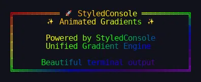

______________________________________________________________________

## Feature Showcase

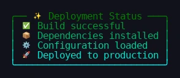 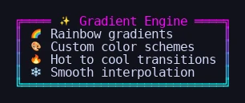

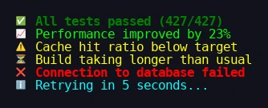 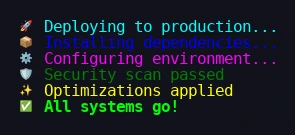

______________________________________________________________________

## Smart Icon System

Use the `icons` facade for policy-aware symbols with automatic ASCII fallback.

```python
from styledconsole import icons

print(f"{icons.ROCKET} Deploying...")  # Auto-detects terminal
print(f"{icons.CHECK_MARK_BUTTON} Done!")
```

| Environment          | Output | Symbol        |
| -------------------- | ------ | ------------- |
| Modern Terminal      | `🚀`   | Emoji         |
| CI / Legacy Terminal | `>>>`  | Colored ASCII |

______________________________________________________________________

## Full Color Palette

Use named colors, bright variants, hex RGB, and ANSI 256-color codes.

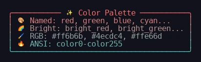

```python
# Rich color support - named colors and RGB
console.text("Red alert!", color="red")
console.text("Green success", color="green")
console.text("Blue info", color="blue")
console.text("Custom RGB", color="#ff6b6b")
```

______________________________________________________________________

## Multiline Gradient Text

Apply smooth color gradients across multiple lines of text.

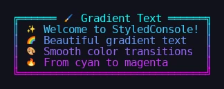

```python
from styledconsole import Console, EffectSpec

console = Console()

# Apply gradient to multiline text
console.frame(
    ["Welcome to StyledConsole!", "Beautiful gradient text", "Across multiple lines"],
    effect=EffectSpec.gradient("cyan", "magenta", target="content"),
    border="rounded"
)
```

______________________________________________________________________

## Rich Text Styling

Apply bold, italic, underline, strikethrough, and dim effects to any text.

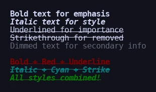

```python
from styledconsole import Console

console = Console()

# Text styling with bold, italic, underline, strikethrough
console.text("Bold text for emphasis", bold=True)
console.text("Italic text for style", italic=True)
console.text("Underlined for importance", underline=True)
console.text("Strikethrough for removed", strike=True)

# Combined styles with colors
console.text("Bold + Red + Underline", bold=True, color="red", underline=True)
console.text("Italic + Cyan + Strike", italic=True, color="cyan", strike=True)
```

______________________________________________________________________

## Advanced Frame Engine

Build complex, multi-layered UI architectures with 8 beautiful border styles.

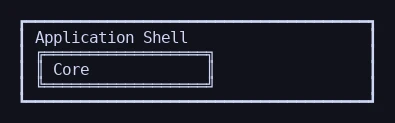

```python
from styledconsole import Console

console = Console()
inner = console.render_frame("Core", border="double", width=20)
console.frame(["Application Shell", inner], border="heavy", width=40)
```

### 8 Beautiful Border Styles

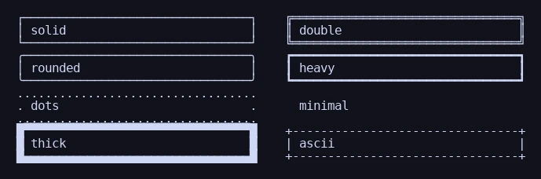

```python
# 8 beautiful border styles available
styles = ["solid", "double", "rounded", "heavy", "dots", "minimal", "thick", "ascii"]
for style in styles:
    console.frame(f"{style}", border=style, width=20)
```

______________________________________________________________________

## ASCII Art Banners

Generate massive, high-impact headers using 500+ fonts with gradient support.

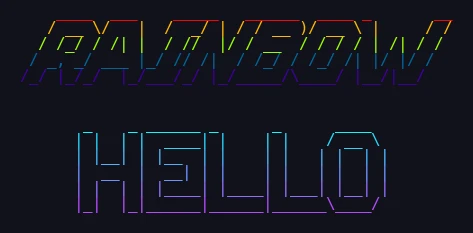

```python
from styledconsole import Console, EFFECTS, EffectSpec

console = Console()

# Full ROYGBIV rainbow spectrum
console.banner("RAINBOW", font="slant", effect="rainbow")

# Two-color gradient
console.banner("HELLO", font="big", effect=EffectSpec.gradient("cyan", "magenta"))
```

______________________________________________________________________

## Live Animations & Progress

Create dynamic terminal experiences with themed progress bars.

<!-- markdownlint-disable MD033 -->

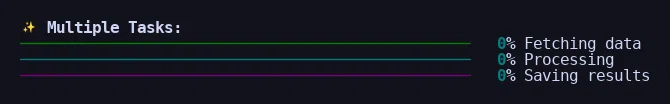
<!-- markdownlint-enable MD033 -->

```python
from styledconsole import StyledProgress
from styledconsole.animation import Animation

# Themed progress bars with automatic color inheritance
with StyledProgress() as progress:
    task = progress.add_task("Assets", total=100)
    progress.update(task, advance=50)

# Frame-based animation engine for cycling gradients
Animation.run(gradient_generator, fps=20, duration=5)
```

______________________________________________________________________

## Declarative Layout Engine

Build complex dashboards using dictionary/JSON structure.

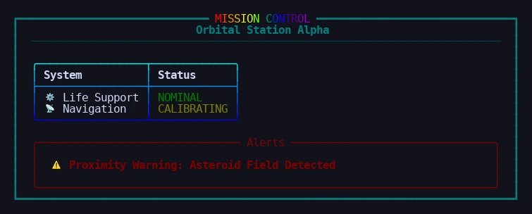

```python
from styledconsole.presets.layouts import create_layout_from_config

# Build entire dashboards from a single dictionary
layout = create_layout_from_config({
    "type": "panel",
    "title": "MISSION CONTROL",
    "title_rainbow": True,
    "border": "heavy",
    "border_style": "cyan",
    "content": {
        "type": "group",
        "items": [
            {"type": "text", "content": "Orbital Station Alpha", "align": "center"},
            {"type": "rule", "style": "cyan dim"},
            {"type": "vspacer"},
            # Nested table component...
            {"type": "table", "theme": {...}, "data": {...}}
        ]
    }
})
console.print(layout)
```

______________________________________________________________________

## Data-Driven Tables

Feed JSON data directly into our table builder for beautiful tables.

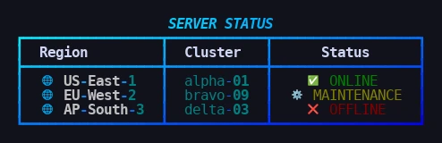

```python
from styledconsole.presets.tables import create_table_from_config

# Config-driven table creation (ideal for loading from JSON/YAML)
table = create_table_from_config(
    theme={
        "border_style": "heavy",
        "gradient": {"start": "cyan", "end": "blue"},
        "title": "SERVER STATUS"
    },
    data={
        "columns": [
            {"header": "Region", "style": "bold white"},
            {"header": "Status", "justify": "center"}
        ],
        "rows": [
            ["US-East", {"text": "ONLINE", "color": "green", "icon": "CHECK_MARK_BUTTON"}],
            ["EU-West", {"text": "MAINTENANCE", "color": "yellow", "icon": "GEAR"}]
        ]
    }
)
console.print(table)
```

______________________________________________________________________

## Real-World Examples

### CI/CD Pipeline Dashboard

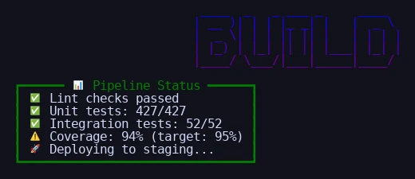

```python
from styledconsole import Console, icons, EffectSpec

console = Console()
console.banner("BUILD", font="standard", effect=EffectSpec.gradient("blue", "purple"))

console.frame([
    f"{icons.CHECK_MARK_BUTTON} Lint checks passed",
    f"{icons.CHECK_MARK_BUTTON} Unit tests: 427/427",
    f"{icons.CHECK_MARK_BUTTON} Integration tests: 52/52",
    f"{icons.WARNING} Coverage: 94% (target: 95%)",
    f"{icons.ROCKET} Deploying to staging...",
], title=f"{icons.BAR_CHART} Pipeline Status", border="heavy", border_color="green")
```

### Error Reporting with Style

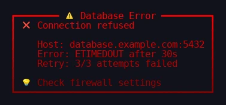

```python
console.frame(
    f"{icons.CROSS_MARK} Connection refused\n\n"
    f"   Host: database.example.com:5432\n"
    f"   Error: ETIMEDOUT after 30s\n"
    f"   Retry: 3/3 attempts failed\n\n"
    f"{icons.LIGHT_BULB} Check firewall settings",
    title=f"{icons.WARNING} Database Error",
    border="heavy",
    effect=EffectSpec.gradient("red", "darkred")
)
```

______________________________________________________________________

## Quick Start Example


```python
from styledconsole import Console, icons, EffectSpec

console = Console()

console.frame(
    f"{icons.CHECK_MARK_BUTTON} Build successful\n"
    f"{icons.ROCKET} Deployed to production",
    title=f"{icons.SPARKLES} Status",
    border="rounded",
    effect=EffectSpec.gradient("green", "cyan"),
)
```

______________________________________________________________________

## v0.10.0 API Showcase

### Builder Pattern

Fluent API for constructing complex UIs step-by-step:

```python
from styledconsole import Console
from styledconsole.model import Spacer

console = Console()

# Build a complete dashboard fluently
header = console.build_banner().text("DASHBOARD").effect("rainbow").build()
status = console.build_frame().title("Status").content("All systems operational").effect("success").build()
metrics = (
    console.build_table()
    .title("Metrics")
    .columns("Service", "Status", "Uptime")
    .row("API", "Online", "99.9%")
    .row("Database", "Online", "99.8%")
    .row("Cache", "Degraded", "95.2%")
    .border("heavy")
    .effect("ocean")
    .build()
)

dashboard = (
    console.build_layout()
    .add(header)
    .add(Spacer(lines=1))
    .add(status)
    .add(metrics)
    .build()
)
console.render_object(dashboard)
```

### Declarative JSON/YAML

Build UIs from configuration without writing Python:

```yaml
# dashboard.yaml
type: layout
items:
  - type: banner
    text: MONITOR
    font: slant
    effect: ocean

  - type: spacer
    lines: 1

  - type: frame
    title: Server Status
    content:
      type: table
      columns: [Server, Status, Uptime]
      rows:
        - [api-1, Online, 99.9%]
        - [api-2, Online, 99.8%]
        - [db-1, Maintenance, 95.2%]
    border: heavy
    effect: success
```

```python
from styledconsole import Console, load_yaml

with open("dashboard.yaml") as f:
    ui = load_yaml(f.read())
Console().render_object(ui)
```

### Jinja2 Templates

Generate dynamic UIs from data:

```python
from styledconsole import Console, render_jinja

template = """
type: frame
title: "{{ title }}"
content:
  type: group
  items:

    - "{{ server.status | status_icon }} {{ server.name }}: {{ server.status }}"

effect: {{ 'success' if all_healthy else 'warning' }}
"""

servers = [
    {"name": "API Gateway", "status": "running"},
    {"name": "Auth Service", "status": "running"},
    {"name": "Database", "status": "warning"},
]

ui = render_jinja(
    template,
    title="Service Health",
    servers=servers,
    all_healthy=all(s["status"] == "running" for s in servers)
)
Console().render_object(ui)
```

### Built-in Templates

22 ready-to-use UI patterns:

```python
from styledconsole import Console

console = Console()

# Alert boxes
console.render_template("info_box", title="Notice", content="Scheduled maintenance tonight")
console.render_template("success_box", content="Deployment completed successfully!")
console.render_template("warning_box", title="Warning", content="Disk space running low")
console.render_template("error_box", title="Error", content="Connection refused")

# Metric cards
console.render_template("metric_card", label="CPU Usage", value="45", unit="%", trend="up")
console.render_template("metric_card", label="Memory", value="2.4", unit="GB", trend="stable")

# Status cards
console.render_template("status_card", title="API Gateway", status="Online", message="Healthy")
```

______________________________________________________________________

## More Examples

For a comprehensive gallery of **over 50 working examples**, visit:

**[StyledConsole-Examples](https://github.com/ksokolowski/StyledConsole-Examples)**

```bash
# Run the local quick start demo
uv run examples/quick_start.py
```
